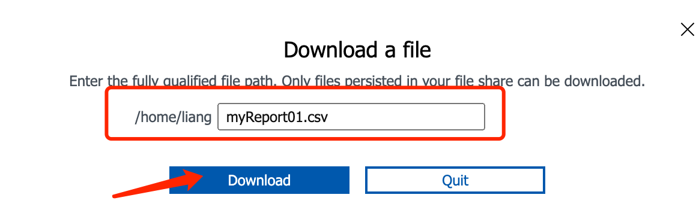

# AZURE获得全部虚机配置明细清单-PowerShell脚本

## 第一步：登录
Azure控制台[[https://portal.azure.com/]{.underline}](https://portal.azure.com/)，进入Subscriptions，获得你的subscriptionId

{width="7.5in"
height="2.8666666666666667in"}

## 第二步：登录
powershell，[[https://shell.azure.com/]{.underline}](https://shell.azure.com/)

{width="4.2660553368328955in"
height="3.587001312335958in"}

## 第三步：执行脚本如下：

```javascript
#Provide the subscription Id where the VMs reside
$subscriptionId = "2a56ad69-0caf-4598-b074-3a8c3fa5ee22"

#Provide the name of the csv file to be exported
$reportName = "myReport01.csv"

Select-AzSubscription $subscriptionId
$report = @()
$vms = Get-AzVM
$publicIps = Get-AzPublicIpAddress 
$nics = Get-AzNetworkInterface | ?{ $_.VirtualMachine -NE $null} 
foreach ($nic in $nics) { 
    $info = "" | Select VmName, ResourceGroupName, Region, VirtualNetwork, Subnet, PrivateIpAddress,  PublicIPAddress, VmSize, OsType, DiskSizeGB, NicName, ApplicationSecurityGroup  
    $vm = $vms | ? -Property Id -eq $nic.VirtualMachine.id 
    foreach($publicIp in $publicIps) { 
        if($nic.IpConfigurations.id -eq $publicIp.ipconfiguration.Id) {
            $info.PublicIPAddress = $publicIp.ipaddress
            } 
        } 
        $info.DiskSizeGB = $vm.StorageProfile.OsDisk.DiskSizeGB 
        $info.OsType = $vm.StorageProfile.OsDisk.OsType 
        $info.VMName = $vm.Name 
        $info.ResourceGroupName = $vm.ResourceGroupName 
        $info.Region = $vm.Location 
        $info.VmSize = $vm.HardwareProfile.VmSize

        $info.VirtualNetwork = $nic.IpConfigurations.subnet.Id.Split("/")[-3] 
        $info.Subnet = $nic.IpConfigurations.subnet.Id.Split("/")[-1] 
        $info.PrivateIpAddress = $nic.IpConfigurations.PrivateIpAddress 
        $info.NicName = $nic.Name 
        $info.ApplicationSecurityGroup = $nic.IpConfigurations.ApplicationSecurityGroups.Id 
        $report+=$info 
    } 

$report | ft VmName, ResourceGroupName, Region, VirtualNetwork, Subnet, PrivateIpAddress,  PublicIPAddress, VmSize, OsType, DiskSizeGB, NicName, ApplicationSecurityGroup 
$report | Export-CSV "$home/$reportName"
```


执行脚本获得 订阅ID下的全部虚机配置明细清单，包括：
VM名称、VM机型、IP地址、磁盘容量等信息

{width="7.5in"
height="4.868055555555555in"}

## 第四步：把 myReport01.csv 的结果文件取回本地，便于进一步统计报表。

{width="4.247706692913386in"
height="2.2361078302712163in"}

{width="4.504587707786527in"
height="1.4164424759405074in"}

{width="7.5in"
height="1.4861111111111112in"}

## 第五步：VMSzie对应的CPU、内存配置列表地址为：

<https://azureprice.net/>

{width="5.373180227471566in"
height="6.98165135608049in"}

<https://docs.microsoft.com/en-us/dotnet/api/microsoft.azure.management.compute.models.hardwareprofile.vmsize?view=azure-dotnet>

<https://docs.microsoft.com/en-us/azure/virtual-machines/sizes>
